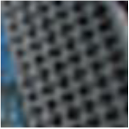
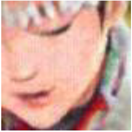

# Exploring Frequency-Inspired Optimization in Transformer for Efficient Single Image Super-Resolution

Ao Li, Le Zhang, Yun Liu and Ce Zhu, "Exploring Frequency-Inspired Optimization in Transformer for Efficient Single Image Super-Resolution", TPAMI, 2025

[[arXiv](https://arxiv.org/abs/2308.05022)] [[pretrained models](https://drive.google.com/file/d/1TaFjO7rqlu1Cc0C_3ERp_EW5Xx9Pl0-n/view?usp=sharing)]

---

> **Abstract:** *Transformer-based methods have exhibited remarkable potential in single image super-resolution (SISR) by effectively extracting long-range dependencies. However, most of the current research in this area has prioritized the design of transformer blocks to capture global information, while overlooking the importance of incorporating high-frequency priors, which we believe could be beneficial. In our study, we conducted a series of experiments and found that transformer structures are more adept at capturing low-frequency information, but have limited capacity in constructing high-frequency representations when compared to their convolutional counterparts. Our proposed solution, the cross-refinement adaptive feature modulation transformer (CRAFT), integrates the strengths of both convolutional and transformer structures. It comprises three key components: the high-frequency enhancement residual block (HFERB) for extracting high-frequency information, the shift rectangle window attention block (SRWAB) for capturing global information, and the hybrid fusion block (HFB) for refining the global representation. To tackle the inherent intricacies of transformer structures, we introduce a frequency-guided post-training quantization (PTQ) method aimed at enhancing CRAFT’s efficiency. These strategies incorporate adaptive dual clipping and boundary refinement. To further amplify the versatility of our proposed approach, we extend our PTQ strategy to function as a general quantization method for transformer-based SISR techniques. Our experimental findings showcase CRAFT’s superiority over current state-of-the-art methods, both in full-precision and quantization scenarios. These results underscore the efficacy and universality of our PTQ strategy.*
>
> <p align="center">
> 
> </p>
---

## Floating-point Visual Results
|                      HR                      |                        LR                         | [SwinIR](https://github.com/JingyunLiang/SwinIR) |  [ESRT](https://github.com/luissen/ESRT)  |                  CRAFT (ours)                   |
| :------------------------------------------: | :-----------------------------------------------: | :----------------------------------------------: | :-------------------------------------------: | :-------------------------------------------: |
|  |  |  |  |  |
|  |  |  |  |  |

## Qunatization Visual Results (4-bit X4)
|                      Full-Precision                      |                        LR                         | MinMax |  PTQ4SR  |                  Ours                |
| :------------------------------------------: | :-----------------------------------------------: | :----------------------------------------------: | :-------------------------------------------: | :-------------------------------------------: |
|  |  |  |  |  |
|  |  |  |  |  |

## Dependencies & Installation

- Python 3.7
- PyTorch 1.10.2
- NVIDIA GPU + [CUDA 11.7](https://developer.nvidia.com/cuda-downloads)

```bash
git clone https://github.com/AVC2-UESTC/Frequency-Inspired-Optimization-for-EfficientSR.git
conda create -n CRAFT python=3.7
conda activate CRAFT
pip install -r requirements.txt
```

## Training

### Floating-point Model Training Procedure

- Download the [train datasets](https://cv.snu.ac.kr/research/EDSR/DIV2K.tar) and place them in the `datasets` directory.

- Run the following script to start the training process.

  ```shell
  # Train with 4 GPUs
  # X4 scaling
  bash scripts/dist_train.sh 4 \
    options/train/CRAFT/train_CRAFT_SRx4_scratch.yml 
  ```

### Quantized Model Training Procedure
- Randomly sample and crop 128x128 sub-images, and place in the `datasets/calibration_data` directory.
- Run the following scripts to perform quantization:
  ```shell
  # Train with 1 GPU
  # Stage 1: Adaptive Dual Clipping Process
  python PTQ/Adaptive_Dual_Clipping_main.py \
    --output_dir results/ptq \
    --saved_model_path experiments/train_CRAFT_SR_X4/PTQ_models \
    --fp_model_path experiments/pretrained_models/float_models/CRAFT_MODEL_x4.pth \
    --traindir_LR datasets/calibration_data/X4 \
    --benchmarks Set5+Set14+B100 \
    --scale 4 \
    --bits 4

  # Stage 2: Boundary Refinement Process
  python PTQ/Boundary_Refinement_main.py \
    --output_dir results/ptq \
    --saved_model_path experiments/train_CRAFT_SR_X4/PTQ_models \
    --fp_model_path experiments/train_CRAFT_SR_X4/float_models/CRAFT_MODEL_x4.pth \
    --ptq_adc_model_path experiments/train_CRAFT_SR_X4/PTQ_models/CRAFT_MODEL_4bit_x4_ADC.pth \
    --traindir_LR datasets/calibration_data/X4 \
    --benchmarks Set5+Set14+B100 \
    --scale 4 \
    --bits 4 \
    --epochs 10 \
    --lr 0.002
  ```

## Testing

### Test images with High-Resolution (HR) Images

- Download the pre-trained [models](https://drive.google.com/file/d/13wAmc93BPeBUBQ24zUZOuUpdBFG2aAY5/view?usp=sharing) and place them in `experiments/pretrained_models/`. 

  Floating-point models: CRAFT_MODEL_x2, CRAFT_MODEL_x3, and CRAFT_MODEL_x4. 
  
  Qunatized models: CRAFT_MODEL_4bit_x4,  CRAFT_MODEL_6bit_x4 and CRAFT_MODEL_8bit_x4.

- Download [test datasets](https://drive.google.com/drive/folders/1BtRY2CfpXfgkzabwDmrJaKl1LcIfdsQu?usp=sharing), place them in `datasets/benchmark`.

- Run the following scripts.

  ```shell
  # Test Set5 (X4) 
  # Floating-point model
  python inference/inference_CRAFT.py --scale 4 --model_path experiments/pretrained_models/float_models/CRAFT_MODEL_x4.pth --folder_lq datasets/benchmark/Set5/LR_bicubic/X4 --input datasets/benchmark/Set5/HR --output results/CRAFT/Set5/X4
  
  # 4-bit quantized model
  python PTQ/PTQ_eval.py --model_path experiments/pretrained_models/PTQ_models/CRAFT_MODEL_4bit_x4.pth --bits 4

  # 6-bit quantized model
  python PTQ/PTQ_eval.py --model_path experiments/pretrained_models/PTQ_models/CRAFT_MODEL_6bit_x4.pth --bits 6

  # 8-bit quantized model
  python PTQ/PTQ_eval.py --model_path experiments/pretrained_models/PTQ_models/CRAFT_MODEL_8bit_x4.pth --bits 8
  ```
- The results will be saved in the `results` directory.


## Results
### Floating-point 

| Model         | #Parameters | Set5         | Set14        | BSD100        | Urban100      | Manga109     |
|:-------------:|:-----------:|:------------:|:------------:|:-------------:|:-------------:|:------------:|
|CRAFT-X2       | 737K        | 38.23/0.9615 |33.92/0.9211  |32.33/0.9016   |32.86/0.9343   |39.39/0.9786  |
|CRAFT-X3       | 744K        | 34.71/0.9295 |30.61/0.8469  |29.24/0.8093   |28.77/0.8635   |34.29/0.9491  |
|CRAFT-X4       | 753K        | 32.52/0.8989 |28.85/0.7872  |27.72/0.7418   |26.56/0.7995   |31.18/0.9168  |
### Quantization (X4)

| Model         | #W/A | Set5         | Set14        | BSD100        | Urban100      | Manga109     |
|:-------------:|:-----------:|:------------:|:------------:|:-------------:|:-------------:|:------------:|
|Full-Precision       | 32/32        | 32.52/0.8989 | 28.85/0.7872 | 27.72/0.7418 | 26.56/0.7995 | 31.18/0.9168  |
|CRAFT-8bits       | 8/8        | 32.45/0.8965 | 28.80/0.7850 | 27.68/0.7397 | 26.49/0.7967 | 31.06/0.9141  |
|CRAFT-6bits       | 6/6        | 32.01/0.8820 | 28.51/0.7717 | 27.49/0.7272 | 26.16/0.7808 | 30.11/0.8922  |
|CRAFT-4bits       | 4/4        | 29.46/0.7854 | 26.92/0.6891 | 26.32/0.6492 | 24.50/0.6787 | 27.03/0.7653  |

## Acknowledgements

This code is built on  [BasicSR](https://github.com/XPixelGroup/BasicSR), [CAT](https://github.com/zhengchen1999/CAT), [Restormer](https://github.com/swz30/Restormer), and [FQ-ViT](https://github.com/megvii-research/FQ-ViT).
